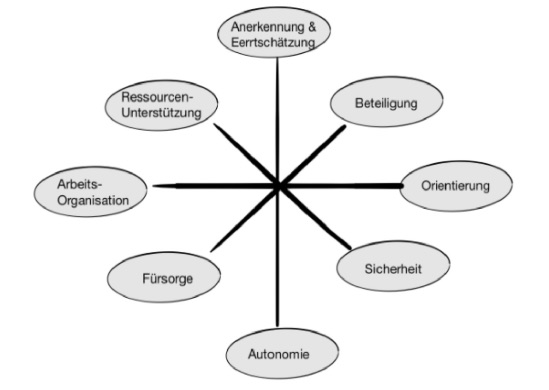

# Unternehmensrelevante Unterstützungsmöglichkeiten zur Prävention von Burnout

Fühlen Sie sich oft erschöpft, ausgebrannt und müde? Überforderung und Frustration am Arbeitsplatz sind bei Ihnen Dauerzustände? Dann könnten Sie, wie immer mehr Berufstätige, Gefahr laufen an Burnout zu erkranken. Seit Jahren steigen die Zahlen der Burnout Fälle in Deutschland, so meldete die AOK im Jahr 2017 durchschnittlich 5,5 Arbeitsunfähigkeitsfälle je 1.000 Mitglieder aufgrund einer Burnout Diagnose. Dies entspricht beinahe einer Verdreifachung der Diagnosehäufigkeit innerhalb des letzten Jahrzehnts.Laut Hochrechnungen der AOK ergeben sich daraus über alle gesetzlich Krankenversicherten hinweg rund 166.000 Burnout Betroffene und damit 3.7 Millionen Krankheitstage im Jahr 2017 (Statista, 2019).

## Was ist Burnout?

Burnout bezeichnet ein psychologisches Syndrom, welches durch die drei Hauptkriterien Emotionale Erschöpfung, Depersonalisation und reduzierte Leistungsfähigkeit gekennzeichnet ist (Maslach & Leiter, 2001).

[Fische](blog/fische.md)

## Referenzen

[Mein bester Professor](https://ulrich-anders.eu)

[Gefährung und Schutz der Haie](https://www.bfn.de/fileadmin/BfN/service/Dokumente/skripten/Skript450.pdf)
