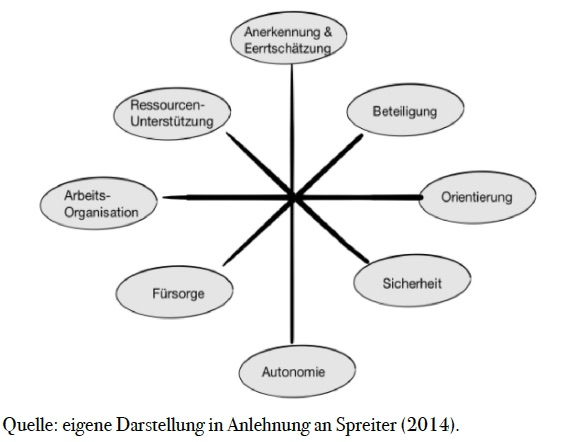

# Unternehmensrelevante Unterstützungsmöglichkeiten zur Prävention von Burnout

Fühlen Sie sich oft erschöpft, ausgebrannt und müde? Überforderung und Frustration am Arbeitsplatz sind bei Ihnen Dauerzustände? Dann könnten Sie, wie immer mehr Berufstätige, Gefahr laufen an Burnout zu erkranken. Seit Jahren steigen die Zahlen der Burnout Fälle in Deutschland, so meldete die AOK im Jahr 2017 durchschnittlich 5,5 Arbeitsunfähigkeitsfälle je 1.000 Mitglieder aufgrund einer Burnout Diagnose. Dies entspricht beinahe einer Verdreifachung der Diagnosehäufigkeit innerhalb des letzten Jahrzehnts.Laut Hochrechnungen der AOK ergeben sich daraus über alle gesetzlich Krankenversicherten hinweg rund 166.000 Burnout Betroffene und damit 3.7 Millionen Krankheitstage im Jahr 2017 (Statista, 2019).

## Was ist Burnout?

Burnout bezeichnet ein psychologisches Syndrom, welches durch die drei Hauptkriterien Emotionale Erschöpfung, Depersonalisation und reduzierte Leistungsfähigkeit gekennzeichnet ist (Maslach & Leiter, 2001). Im Folgenden möchte ich kurz auf die drei Kriterien eingehen:

1. Emotionale Erschöpfung:
   Durch die dauerhafte Beanspruchung emotionaler Ressourcen fühlen sich die Betroffenen erschöpft und leer. Der Kontakt mit anderen wird als ermüdend und anstrengend wahrgenommen.
2. Depersonalisation:
   Die Betroffenen entwickeln eine negative und zynische Haltung gegenüber ihrer Arbeit und Arbeitskollegen.
3. Reduzierte Leistungsfähigkeit:
   Die eigene Leistungsfähigkeit wird angezweifelt. Dies führt bei den Betroffenen zu einem negativen beruflichen Selbstwert und einem Gefühl von Inkompetenz.

Burnout wurde zunächst als Phänomen in Bereichen der sozialen Arbeit untersucht (Maslach & Leiter, 2001). Mittlerweile ist das Syndrom bei rund 60 verschiedenen Berufsgruppen beschrieben und dokumentiert worden und gilt über alle Berufe hinweg als zentrales Thema (Burisch, 2014). Ich spreche bewusst von Burnout als Syndrom, denn Burnout stellt bisher kein eigenständiges Krankheitsbild dar. Im ICD-10, dem aktuellen internationalen Diagnoseschlüssel, ist es lediglich als Zusatzindikation aufgelistet (Braun & Hillebrecht,2016).

## Wie entsteht Burnout?

Um die unterschiedlichen Ansätze zur Prävention von Burnout besser zu verstehen, ist es hilfreich, zunächst die Entstehungsfaktoren genauer zu beleuchten. In der Forschungsliteratur finden sich sehr unterschiedliche
Erklärungsversuche für die Entstehung von Burnout. Immer wieder werden vor allem organisationale Faktoren als Determinanten für Erschöpfung und Stress untersucht (Burisch, 2014). Rollenkonflikte, Fehlen von Fairness und mangelnde Autonomie sind nur einige Aspekte, die zu Burnout beitragen sollen (Maslach & Leiter, 2001). Auch wenn sich die Forschungsliteratur einig ist, dass es etwas wie die „ausbrennende Persönlichkeit“ nicht gibt, findet sich dennoch vermehrt Forschung zu Zusammenhängen zwischen Persönlichkeitsmerkmalen und Burnout. Vor allem die Facette „Neurotizismus“ wird immer wieder mit Burnout in Verbindung gebracht (Burisch, 2014). Insgesamt herrscht jedoch weitestgehend Einigkeit darüber, dass die Entstehung von Burnout auf einem
komplexen Zusammenspiel aus individuellen, organisationalen und gesellschaftlichen Faktoren beruht (z.B., Schneider, 2014; Spreiter, 2014). Warum sollten Unternehmen Interesse an Burnout Prävention haben?
Burnout Prävention kann ein unliebsames Thema innerhalb der Unternehmensführung sein (Spreiter, 2014). Es verursacht Kosten und beansprucht Zeit. Dennoch sollte das Thema nicht nur aus altruistischen
Gründen in den Köpfen der Führungsverantwortlichen sein. Denn ganz klar ist: Burnout Prävention ist vor allem wirtschaftlich sinnvoll! Psychische Erkrankungen zählen deutschlandweit seit Jahren zu den häufigsten und kostenintensivsten Krankheiten (DAK Gesundheitsreport, 2018). Die durchschnittliche Ausfallzeit eines Burnout – Patienten beträgt 40 Arbeitstage (Burisch, 2014). Getreu dem englischen Sprichwort „an ounce of prevention is worth a pound of cure“ sollten Arbeitgeber demnach großes Interesse an Präventionsmaßnahmen haben. Die Realität scheint jedoch eine andere zu sein: Bei einer im Jahr 2017 durchgeführten Umfrage des Statistik Portals Statista wurde nach unternehmensseitigen Maßnahmen zur Prävention von Burnout gefragt. Lediglich 22% der Befragten arbeiteten in Unternehmen, die Burnout Präventionsmaßnahmen anboten.

## Welche unternehmensrelevanten Maßnahmen zur Burnout Prävention gibt es?

„Burnout Prävention, das ist Aufgabe des Betrieblichen Gesundheitsmanagement“ – stimmt, solche Aussagen greifen allerdings zu kurz. Wie die Ergebnisse einer im Jahr 2014 durchgeführten Studie zur Prävention von Burnout belegen, haben vor allem die direkten Führungskräfte einen entscheidenden Einfluss auf die Entstehung bzw. Prävention von Burnout. Faktoren wie Wertschätzung von Leistung, gleiche und faire Behandlung,ein guter kollegialer Umgang sowie die Möglichkeit sich aktiv miteinzubringen wurden als zentrale Kriterien genannt (Schneider, 2014). Auch Maslach und Leiter (2001) identifizieren eine ertragbare Arbeitsbelastung,
Gefühle von Entscheidungsfreiheit und Kontrolle, Anerkennung und Belohnung, Gemeinschaftssinn, Fairness, Respekt und Gerechtigkeit sowie eine sinnvolle und wertvolle Arbeit als zentrale Faktoren zur Prävention von Burnout. Spreiter (2014) spricht von einem aktiven, ressourcenorientierten Führungsverhalten als wirkungsvoller Beitrag zur Prävention von Burnout. Wichtig ist „die Gewährung von Mitbestimmungs- und Beteiligungsmöglichkeiten sowie Anerkennung und Wertschätzung“ (Spreiter, 2014, S.161). All diese Funde belegen, dass vor allem im Rahmen der Primärprävention (Prävention am gesunden Menschen), das Verhalten der
Führungskraft eine zentrale präventive Maßnahme darstellen kann. Dieser Befund hat große praktische Relevanz. Vor allem kleine und mittelständische Unternehmen stehen hinsichtlich der Burnout Prävention vor besonderen Herausforderungen, denn oft fehlen diesen Unternehmen die nötigen Ressourcen, um teure Workshops und Supervisionen extern einzukaufen (Braun & Hillebrecht, 2016). Umso spannender ist, dass dies nicht zwingend notwendig zu sein scheint. Wichtiger ist es, Führungskräfte für das Thema Burnout Prävention zu sensibilisieren und ihnen ihre Handlungsmöglichkeiten aufzuzeigen. Sie können zum Beispiel die Ressourcen ihrer Mitarbeiter stärken, in dem sie bewusste Auszeiten schaffen. Sie können ein aktives Talentmanagement betreiben, indem sie die Stärken ihrer Mitarbeiter erkennen und ihnen in diesen Bereichen Freiräume lassen. Zentral ist außerdem eine Wertschätzungskultur zu entwickeln und ein Gefühl von Sicherheit zu schaffen (Spreiter, 2014). Im Folgenden Chart sind die Komponenten eines Burnout-präventiven Führungsstils noch einmal
zur besseren Übersicht dargestellt.

Natürlich liegt es nicht an der Führungskraft alleine Burnout zu verhindern. Vor allem wenn es sich um
sekundäre Präventionsmaßnahmen handelt, sollten diese vom Betrieblichen Gesundheitsmanagement oder der Personalabteilung ausgehen. Sekundäre Präventionsmaßnahmen sind an Menschen gerichtet, bei denen das Risiko ein Burnout zu erleiden erhöht ist. Wie erkennt man als Unternehmensführung solche Mitarbeiter? Eine Möglichkeit ist die Durchführung von gezielten gesundheitsfördernden Mitarbeiterbefragungen,
zum Beispiel durch die Verwendung des Maslach Burnout Inventory (MBI) (Maslach & Jackson, 1986). Das MBI ist das bekannteste Instrument zur Untersuchung von Burnout. Es besteht aus 22 Items, welche die vorhin besprochenen drei Hauptkriterien von Burnout messen (Burisch, 2014). Solche Mitarbeiterbefragungen sind zeit- und kostenaufwendig und sollten daher lediglich durchgeführt werden, wenn tatsächliche Veränderungsbereitschaft vorhanden ist. Basierend auf den Ergebnissen der Mitarbeiterbefragung (oder im Zuge einer Primärprävention) haben Unternehmen eine Fülle von Maßnahmen zur Verfügung. Im Folgenden soll daher
eine kurze Auswahl an möglichenPräventionsmaßnahmen vorgestellt werden.

### Coaching / Workshops:

Hierbei kann es sich um Einzel- oder Gruppencoaching handeln. Zielgruppe können sowohl Mitarbeiter, Führungskräfte als auch ganze Teams oder Abteilungen sein. Coachings und Workshops können fachlicher, methodischer oder sozialer Natur sein, basierend auf der vorherigen Bedarfsanalyse (z.B. durch Mitarbeiterbefragungen). Eine beliebte Form von Burnout Präventionsmaßnahmen sind Stressmanagementtrainings.
Ziel ist das Erlernen von emotions- und problembezogenen Bewältigungsstrategien. Diese sollen helfen, mit stressigen Situationen besser umzugehen. Stressmanagementtrainings beinhalten sowohl Elemente der kognitiven Verhaltenstherapie als auch Entspannungstechniken und Zeitmanagementtechniken (Schaper, 2019)

### Gesundheitszirkel:

Gesundheitszirkel sind innerbetriebliche Arbeitskreise, in denen sich eine ausgewählte Gruppe an Mitarbeitern gezielt mit Fragestellungen zu gesundheitlichen Belastungen beschäftigt. Gemeinsam werden Maßnahmen zur Reduktion von Distress und dauerhafter Erschöpfung erarbeitet. Ein großer Vorteil von Gesundheitszirkeln
ist die aktive Beteiligung der Mitarbeiter und die damit einhergehende hohe Akzeptanz der erarbeiteten Maßnahmen. (Spreiter, 2014)

### Employee Assistance Program (EAP):

EAP sind Programme zur Mitarbeiterberatung durch externe Unternehmen. Mitarbeiter können sich telefonisch oder vor Ort zu Themen wie Stressmanagement und Burnout Prävention beraten lassen. Ein großer Vorteil
besteht in der Anonymität, dies senkt die Hemmschwelle der Mitarbeiter negative emotionale Zustände offen anzusprechen (Burisch, 2014).

Selbstverständlich hängt die Implementierung oben genannter Präventionsmaßnahmen von den jeweils verfügbaren Ressourcen eines Unternehmens ab. Dennoch sollte jede Unternehmensführung Burnout Prävention zu einem zentralen Thema erklären, denn nur durch den sensiblen Umgang und frühzeitige Prävention kann eine langfristig leistungsfähige Belegschaft sichergestellt werden (Maslach & Leiter, 2001). Basierend auf der Forschungsliteratur bin ich der Meinung, dass Unternehmen vor allem bei den Führungskräften ansetzen sollten,wenn es um die Prävention von Burnout bei Mitarbeitern geht. Das Verhalten der Führungskraft stellt nachweislich einen zentralen präventiven Faktor dar (z.B. Spreiter, 2014) und ist unabhängig von Größe und Ressourcen des Unternehmens beinflussbar.

## Referenzen

Braun, E., & Hillebrecht, S. (2016). Arbeitsbuch Burnout für Unterehmensberater, Führungskräfte und Betriebsräte:. Praktische Hilfen für die Prävention und das Wiedereingliederungsmanagement auf der Basis der Würzburger Burnout-Studie. München, Mering: Rainer Hampp Verlag.

Burisch, M. (2014). Das Burnout – Syndrom (5. Aufl.). Berlin, Heidelberg: Springer.

[DAK: - Gesundheitsreport 2018. als pdf- Ressource vom März 2018. Zugriff am 16.10.2019](https://www.dak.de/dak/download/gesundheitsreport-2018-pdf-2073702.pdf)

Greve, G. (2018). Organizational Burnout: Das verstecke Phänomen ausgebrannter Organisationen (4. Aufl.).
Wiesbaden: Springer Gabler.

Maslach, C. & Jackson, S.E. (1986). Maslach Burnout Inventory (2. Aufl.). Palo Alto, Ca.: Consulting Psychologists Press.

Maslach, C., & Leiter, M. P. (2001). Die Wahrheit über Burnout. Stress am Arbeitsplatz und was Sie dagegen tun können . Wien: Springer.

Schaper, N. (2019). Wirkungen der Arbeit. In Nerdinger, F. W., Blickle, G., & Scharper, N. (2019). Arbeits- und Organisationspsychologie (S. 592- 593). Berlin: Springer.

Scherrmann, U. (2015). Stress und Burnout in Organisationen: Ein Praxisbuch für Führungskräfte,
Personalentwickler und Berater. Berlin: Springer.

Schneider, E. (2014). Sicherer Umgang mit Burnout im Unternehmen: Individuelle und unternehmenskulturelle
Zusammenhänge. Wiesbaden: Springer VS.

Spreiter, M. (2014). Burnoutprävention für Führungskräfte. Freiburg, München: Haufe.

[Statista (2019) Welche Maßnahmen bietet Ihr Unternehmen zur Vorbeugung bzw. zur Reintegration bei Burn-Out
an? Zugriff am 15.10.2019](https://de.statista.com/statistik/daten/studie/201217/umfrage/massnahmen-in-unternehmen-zur-burn-out-praevention/)

[Statista (2019) Arbeitsunfähigkeitsfälle aufgrund von Burn-out-Erkrankungen\* in Deutschland in den Jahren 2004 bis 2017 (je 1.000 AOK-Mitglieder). Zugriff am 15.10.2019 ](https://de.statista.com/statistik/daten/studie/239872/umfrage/arbeitsunfaehigkeitsfaelle-aufgrund-vonburn-out-erkrankungen/)
